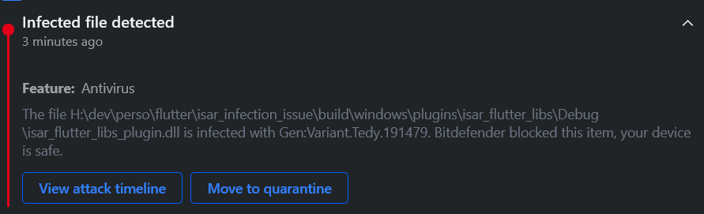

# isar_infection_issue

## Requirements
| Item              | Version                                    |
| ----------------- | ------------------------------------------ |
| Platform          | Windows 10                                 |
| Flutter           | 3.0.5                                      |
| Bitdefender       | database up to date                        |
| Isar dependencies | versions in [pubspec.yaml](./pubspec.yaml) |

## Replicating the issue
1. Execute `flutter pub get`
2. Execute `flutter run -d windows`
3. Notice Bitdefender (Antivirus feature) Report

4. Notice error in the console

5. Send the file to VirusTotal for analysis and notice the [report](https://www.virustotal.com/gui/file/d060fdfb6081ddd3b5d58910d32bbe01befb43a30a641b4b23e7e4b7e6685f0a?nocache=1)